#  아파트의 진실을 알고 싶다면 [아파트루]

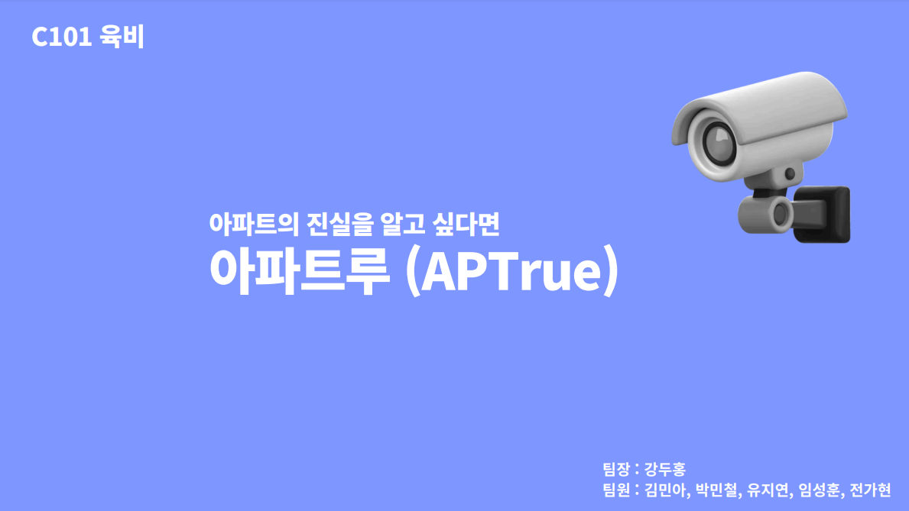
## Index
#### &emsp; [➤ 프로젝트 소개](##-프로젝트-소개) 
#### &emsp; [➤ 개발 환경](##-개발-환경) 
#### &emsp; [➤ 기능 소개](##-기능-소개) 
#### &emsp; [➤ 산출물](##-산출물) 
#### &emsp; [➤ 팀 소개](##-팀-소개) 

## 프로젝트 소개
**AI를 활용한 아파트 CCTV 관리 서비스입니다.**
- 시간과 비용은 줄이고 신뢰성은 높인 AI 비식별화
- 위험 부담은 줄이고 위급 상황 대응은 빨라진 화재 감지
- 귀찮음은 줄이고 확인은 편리한 불법 주차 감지

### 프로젝트 기간
**2024.10.14 ~ 2024.11.19 (총 6주)**

## 개발 환경
- BE: SpringBoot 3.3.3, Java 17
- FE: Next.js, Saas, Recoil, TypeScript
- AI: Python 3.9, Uvicorn 0.30.6, FastAPI 0.114, TensorFlow 2.17
- DB: MySQL 8.0.39, MongoDB 7.0.12
- Infra: Ubuntu 20.04, Docker, Portainer, caddy-docker-proxy

### 협업 관리 툴

 

## 기능 소개

### 로그인
- **로그인 화면**: 관리자 자신의 계정으로 로그인을 할 수 있습니다.
||

### 홈
- **홈 화면**: 실시간으로 아파트 내 CCTV 화면을 볼 수 있습니다.
- **화재 감지**: 화재 발생시 화재가 발생된 장소의 사진과 함께 알림을 받을 수 있습니다.
- **불법 주차 감지**: 불법 주차된 차량과 킥보드 등을 감지하여 알림을 보내 받을 수 있습니다.

|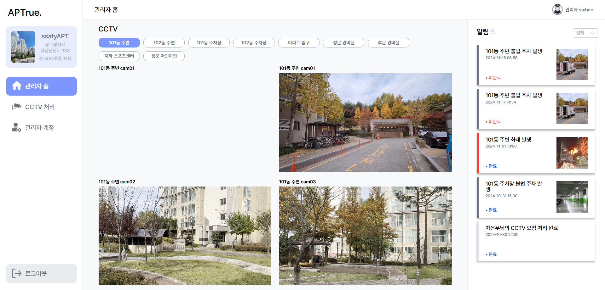|
|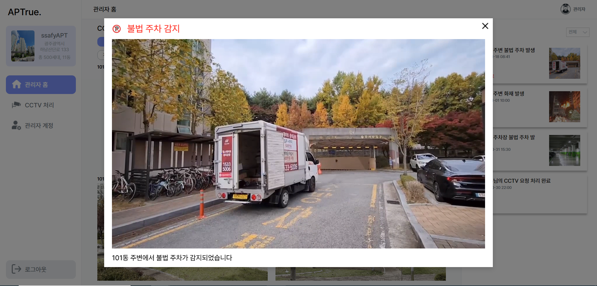|
|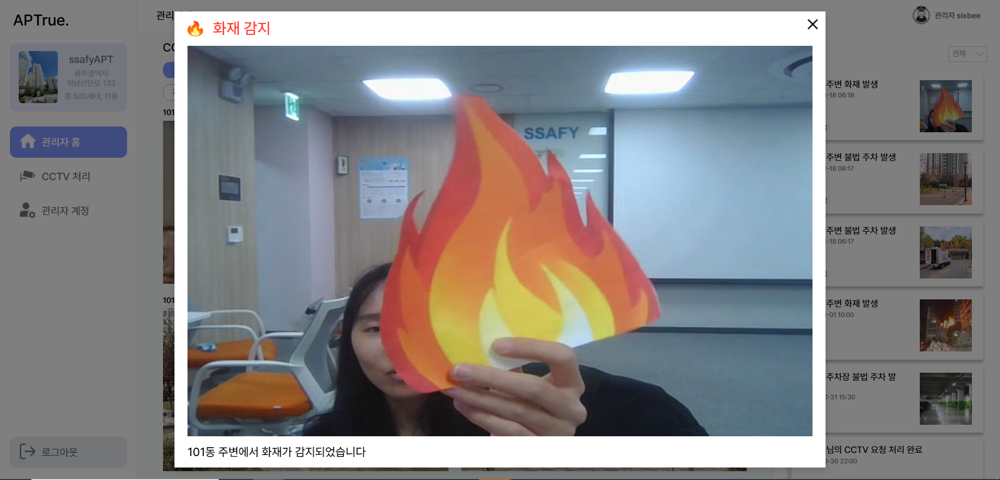|

### CCTV 요청
- **요청 메인 페이지**: CCTV 민원 요청된 기록들을 볼 수 있습니다.
- **요청 생성**: 입주민의 CCTV 민원 요청 정보를 입력할 수 있습니다.
- **요청 완료**: 요청이 완료된 후 처리된 영상을 볼 수 있습니다.

|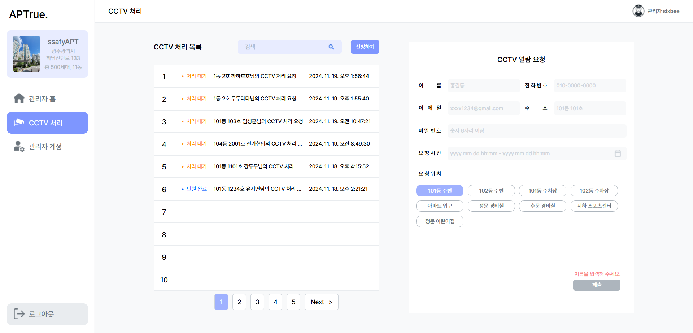|
|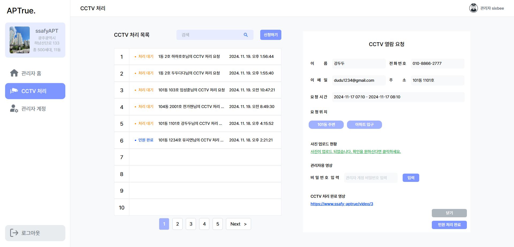|
|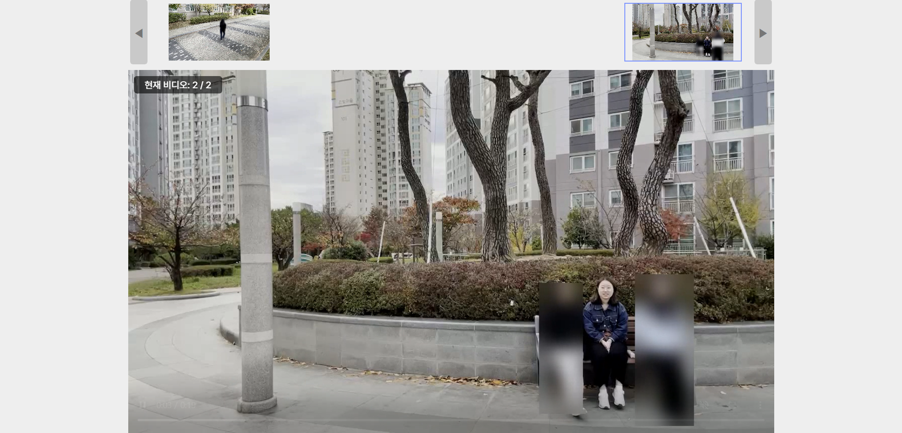|
|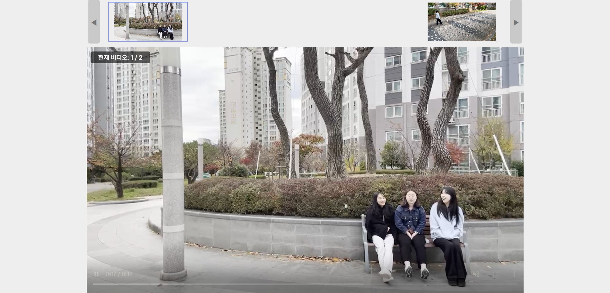|

### 관리자 계정

- **관리자 계정 페이지**: 해당 아파트 내의 관리자들의 정보를 볼 수 있습니다.
- **계정 생성**: 슈퍼 관리자는 아이디, 비밀번호, 전화번호 등을 입력해 관리자를 생성할 수 있습니다.
- **비밀번호 변경**: 해당 관리자를 클릭하여 비밀번호를 변경할 수 있습니다.

|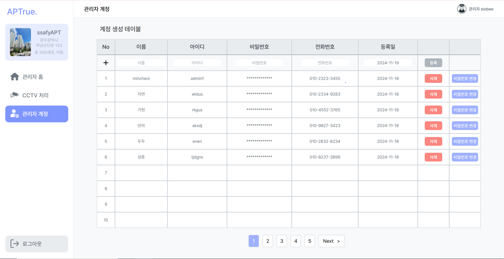
|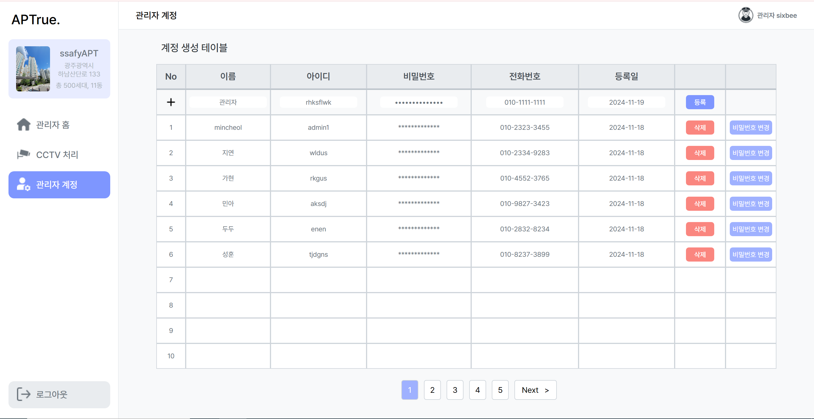
|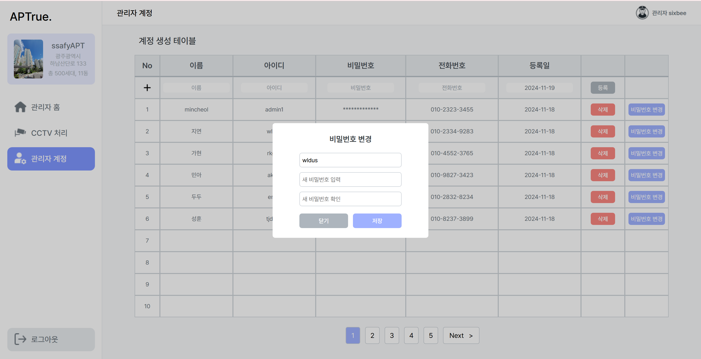|

### 기타

## 산출물
### **[Notion](https://frost-friction-eea.notion.site/C101-APTrue-11fc099d26c0803bb545f0b21838370c?pvs=4)**

### ERD
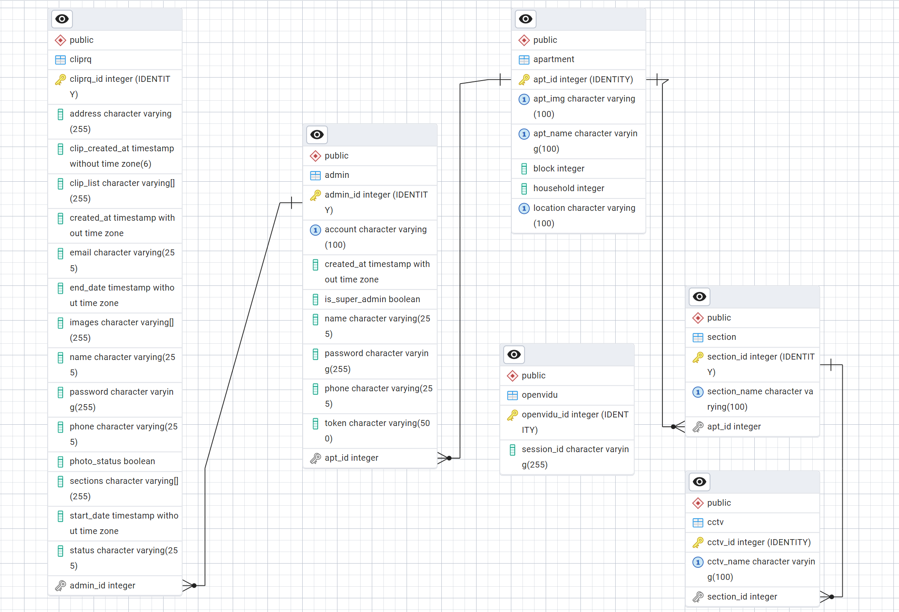

### Architecture 구조도
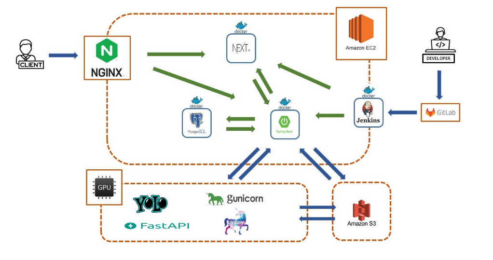

## 팀 소개
<table>
<thead>
<tr>
<th style="text-align: center;"><strong>강두홍</strong></th>
<th style="text-align: center;"><strong>김민아</strong></th>
<th style="text-align: center;"><strong>박민철</strong></th>
<th style="text-align: center;"><strong>유지연</strong></th>
<th style="text-align: center;"><strong>임성훈</strong></th>
<th style="text-align: center;"><strong>전가현</strong></th>
</tr>
</thead>
<tbody>
<tr>
<td align="center"><a href="https://github.com/dhkang0912">   @dhkang0912</a></td>
<td align="center"><a href="https://github.com/alsdk9349">   @alsdk9349</a></td>
<td align="center"><a href="https://github.com/daringpark">   @daringpark</a></td>
<td align="center"><a href="https://github.com/jiyeoniing">   @jiyeoniing</a></td>
<td align="center"><a href="https://github.com/SSeonghun">   @SSeonghun</a></td>
<td align="center"><a href="https://github.com/gahyoenj">   @gahyoenj</a></td>
</tr>
<tr>
<td align="center"><b>팀장 | FE</td>
<td align="center"><b>BE</td>
<td align="center"><b>AI</td>
<td align="center"><b>FE</td>
<td align="center"><b>INFRA</td>
<td align="center"><b>FE</td>
</tr>
</tbody>
</table>

 

